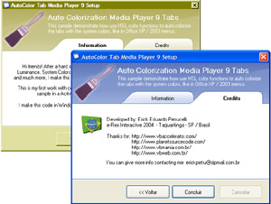



## Auto System Color on Pictures

### Description

Hi people! This is my first code about graphics. This sample demonstrate how you can colorize a picture with the system colors (in this sample a used the look of the Windows Media Player 9 Setup for the pictures). The code uses Hue, Saturation and Luminance functions, converte it to RGB, paint pixel-per-pixel speed using DIB sections and run with themes of Win XP and above or classic themes of other versions. The colors of pictures is obtained with the same code of Office XP / Office 2003 to set the color of their menus. Is very usefull for all programers... And more: apply alpha to a bitmap and show icons of Windows XP with the 32bit (with alpha chanel) suport! I believe that you will like... Bye...
 
### More Info
 

             |
---                |---
**Submitted On**   |2004-05-09 20:13:48
**By**             |[Erick Eduardo Petrucelli](https://github.com/Planet-Source-Code/PSCIndex/blob/master/ByAuthor/erick-eduardo-petrucelli.md)
**Level**          |Advanced
**User Rating**    |4.9 (49 globes from 10 users)
**Compatibility**  |VB 6\.0
**Category**       |[Graphics](https://github.com/Planet-Source-Code/PSCIndex/blob/master/ByCategory/graphics__1-46.md)
**World**          |[Visual Basic](https://github.com/Planet-Source-Code/PSCIndex/blob/master/ByWorld/visual-basic.md)
**Archive File**   |[Auto\_Syste174365592004\.zip](https://github.com/Planet-Source-Code/erick-eduardo-petrucelli-auto-system-color-on-pictures__1-53682/archive/master.zip)

